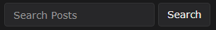
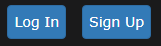
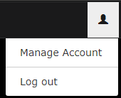
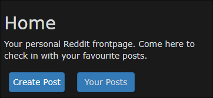
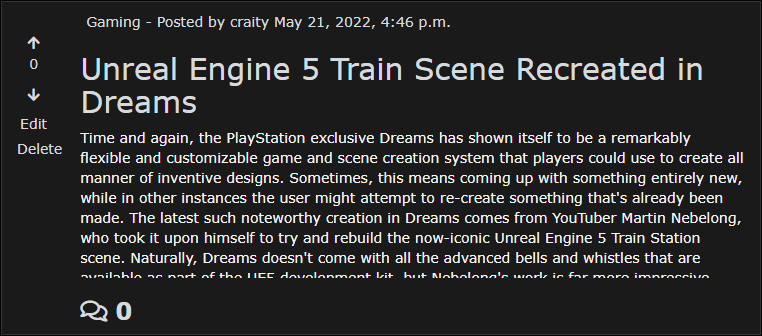
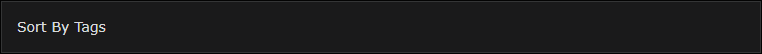
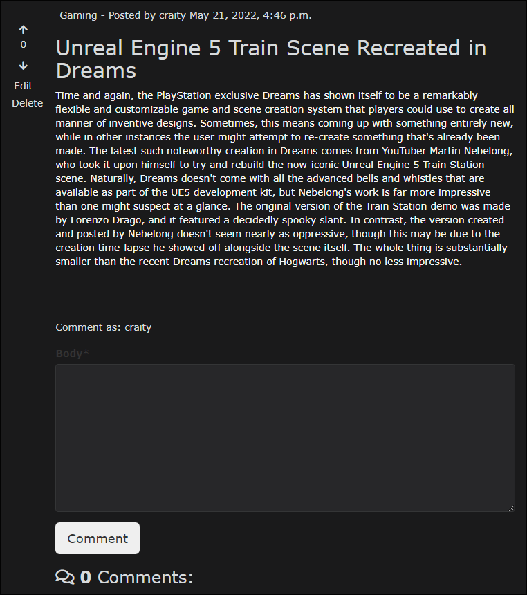
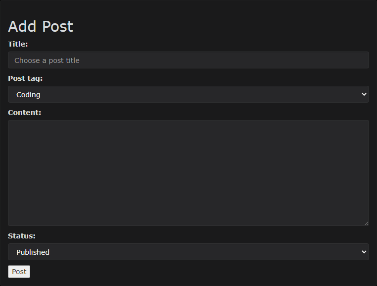
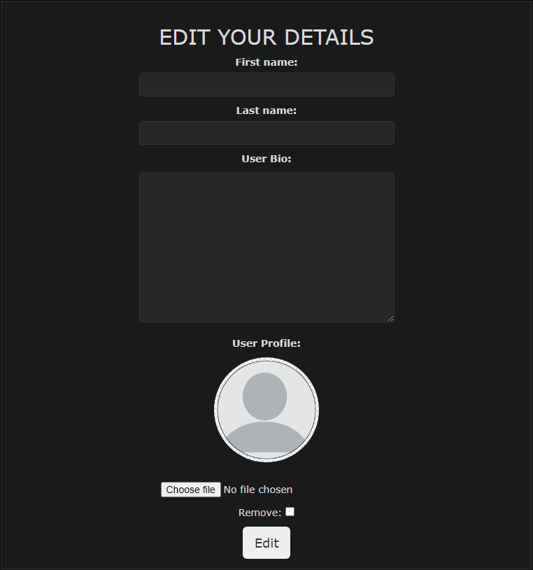
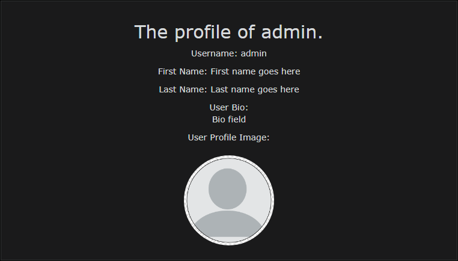

# Chatters

**[Live site](https://cipp4-eryk.herokuapp.com/)**

---

## Index

- <a href="#context">Context</a>
- <a href="#ux">UX</a>
  - <a href="#ux-stories">User stories</a>
  - <a href="#ux-strategy">Strategy</a>
  - <a href="#ux-scope">Scope</a>
  - <a href="#ux-structure">Structure</a>
  - <a href="#ux-wireframes">Wireframes</a>
  - <a href="#ux-design">Design</a>
- <a href="#features">Features</a>
  - <a href="#features-design">Design Features</a>
  - <a href="#features-existing">Existing Features</a>
  - <a href="#features-future">Still to implement</a>
- <a href="#technologies">Technologies Used</a>
- <a href="#testing">Testing</a>
  - <a href="#testing-stories">User Stories</a>
  - <a href="#testing-manual">Manual Testing</a>
  - <a href="#testing-automated">Automated Testing</a>
  - <a href="#testing-bugs">Known bugs</a>
- <a href="#deployment">Deployment</a>
- <a href="#credits">Credits</a>

---

# **Context**

Chatters, a website where you can chat with other people about anything and everything. It is a community platform in the form of a blog where users can
interact with other users posts and share their opinions. Users can create an account where they can edit their profile image, their bio and other
settings.

<a style="text-align:right" href="#top">Go to index :arrow_double_up:</a>

# **UX**

## **User stories**

- As a **User** I want to be able to browse all posts and sort them by their tags.
- As a **User** I want to be able to see the amount of votes and comments on each post.
- As a **User** I want to be able to preview authors profile.
- As a **User** I want to be able to see the time of the posts and comments.
- As a **User** I want to be able to comment on posts and have the option to edit or delete them.
- As a **User** I want to be able to add posts with different tags and get option to publish or draft them.
- As a **User** I want to be able to react to users posts by upvoting or downvoting them.
- As a **User** I want to be able to edit my profile and upload an avatar.
- As a **User** I want to be able to search through all posts.

- As a **Admin** I want to be able to control all of user settings on one page.

<a style="text-align:right" href="#top">Go to index :arrow_double_up:</a>

## **Strategy**

### **Site Aims**

My main aim for the website was to let user to be able to save their posts for future reference as well as interacting with other users. I wanted to create a community where people can quickly access any type of topics they are interested in be it gaming or world news.

The website needs to let user to:

- Sort posts to their needs.
- Create and set up their account.
- Create posts with either published or draft status.
- Upvote or downvote each post.

### **Opportunities**

With the user stories in mind, I have made a table below to narrow down and prioritize the scope of intended strategy.

## **Scope**

A scope was defined to identify what was needed to be done in order to match the strategy outlined before.

- Content Requirements
  - The UX must address
    - A list of posts
    - Posts being sorted into categories (tags)
    - A list of users comments on posts
  - The UX should accommodate
    - Easy navigation
    - Ability to vote and comment

<a style="text-align:right" href="#top">Go to index :arrow_double_up:</a>

## **Structure**

I've created a flow charts to help me visualize what the navigation should feel like. I have also made one with the database scheme to guide me throughout the site progression.

As you can see in aboves images, my database scheme ended up quite accurate but there is one field currently not being used but will be in future implementations. The field I am talking about is in Post model and is **Updated_On**. I have plans to also add one for comments to be able to preview if the post was edited.

## **Wireframes**

The wireframes were successfully converted into a live functioning website across all devices.

The full suite of wireframes for **desktop**, **tablet** and **mobile** devices, can be accessed [here](wireframes/).

<a style="text-align:right" href="#top">Go to index :arrow_double_up:</a>

## **Design**

### **Colour Scheme**

After looking through different reddits and my preference of all websites I browse, I concluded that the best color scheme would be a simple **Dark Theme**. With plans in feature to implement a switch for light theme I though this can be a good idea. The below is the colours I have used the most.

### **Typography**

For fonts I decided to go with what reddit is using. The fonts are as follows, Verdana, Arial, Helvetica and Sans-serif. I think it gives site nice and clear look and ease of readability.

<a style="text-align:right" href="#top">Go to index :arrow_double_up:</a>

# Features

## Design Features

Every page consits of top navigation bar and a side column with consitent and responsive design.
- The top navigation bar contains a site name which brings user back to index page. A search bar to search throughout all published posts and account management buttons such as log in, edit account and log out.
- The side column contains buttons which bring users to their published posts or drafts as well as a button to let them add posts.

## Existing Features

### **Sitewide**

**Navigation Bar**
- The navigation bar consists of a search input and button.
- It also contains of a sign up and log in button if user is not logged in which changes afterwards to an icon which gives the user option of either login out or editing their account.

**Side Column Menu**
- The side column consists of buttons which let users add posts and view their either published posts or drafts.

### **Index**
- The index page has a list of posts sorted by date and the option to sort posts by tags to their needs.
- The post card has options for users if they are the authors as per image. They can delete or edit them.
- As per options on each post, users can upvote or downvote each post to give visible feedback and the amount of comments are also visible.
- The post **tag**, the author and the date is given in each post.

### **Post**
- The post has the same options as stated above in **Index** section.
- The additional features are the ability for users to comment and preview other users comments.
- The full post length is also visible in comparison to **Index** view.
- Add post page contains a simple form layout with necessary fields such as title, tag, content and status.
- The edit post page has the same form layout as previously mentioned add post page with the fields being pre filled.
- The author of the post has ability to delete comments.

### **User Profile**
- The user can edit their profile fields such as their first and last name, their bio and their image.
- Users can access other users profile by pressing on their names in either post author and comment name.
- User profile preview page does not show fields that user has blank in their settings.

### **Other**
- The users published post and draft sections are comparable to **Index** page. Only difference is they can not sort them by tags as of now.
- The delete post feature is a simple page with notifying the user before their decision has been made.

<a style="text-align:right" href="#top">Go to index :arrow_double_up:</a>

## **Features still to implement**

- The ability to edit your own passwords within user settings page.
- The option to upload images into posts and comments and to be able to customize your posts more.
- Add more sorting options such as sort by amount of votes or the amount of comments.
- Add a 'light theme' styling as a button to switch in between.

<a style="text-align:right" href="#top">Go to index :arrow_double_up:</a>

# Technologies

### **Main Languages Used**
- HTML5
- CSS
- Python

### **Frameworks, Libraries and Programs Used**
- Django
- Bootstrap
- Cloudinary
- Crispy Forms
- GitHub
- GitPod

<a style="text-align:right" href="#top">Go to index :arrow_double_up:</a>

# Testing

## User Stories

- As a **User** I want to be able to browse all posts and sort them by their tags.
  - To test this user story I have created posts with different tags. I then accessed the sort by button and selected desired tag.
- As a **User** I want to be able to see the amount of votes and comments on each post.
  - To test this user story I have upvoted/downvoted posts and commented on them. I then checked if on all pages with posts previews the amount of comments and votes get updated.
- As a **User** I want to be able to preview authors profile.
  - To test this user story I clicked on the authors name on each page where posts previews are available. It then brought me to their user profile page.
- As a **User** I want to be able to see the time of the posts and comments.
  - To test this user story I had to add a post. When post was created the date and time was visible on top of the post card. I then went inside the post which brought me to the post page and the date and time were both visible at the same position.
  - To test comments I added a comment on a post, once the comment has been submited successfully, the date and time were on top of the comment easily visible to the user.
- As a **User** I want to be able to comment on posts and have the option to edit or delete them.
  - To test this user story I accessed a post where then I saw a text area field with a button named **Comment**. Once the button has been pressed and text area filled, the comment has been created.
  - Beside the name of user at the comment line, two buttons **Edit** and **Delete** became visible.
- As a **User** I want to be able to add posts with different tags and get option to publish or draft them.
  - To test this user story I pressed the create post button at side column menu. It brought me to a page with a form that is required in order to add a post. The particular fields needed to test this are in the form under 'post tag' and 'status'. Status declares if the form is a draft or published.
- As a **User** I want to be able to react to users posts by upvoting or downvoting them.
  - To test this user story I have clicked on both upvote and downvote buttons. Depending on what button has been pressed the color has been changed to notify the user of what is his vote status.
- As a **User** I want to be able to edit my profile and upload an avatar.
  - To test this user story I had to log in and then go into manage account page which is under the main navbar. It brought me to a page with a form that had fields to edit users account.
- As a **User** I want to be able to search through all posts.
  - To test this user story I have made posts and then searched them by typing into the search field in top navbar section. I then clicked the button 'search' or used keyboard by pressing enter. It brought me to a page with posts containing my searched word.
- As a **Admin** I want to be able to control all of user settings on one page.
  - To test this admin story I went into admin panel and went into Users section. The additional model fields extended were on the bottom of the page.

<a style="text-align:right" href="#top">Go to index :arrow_double_up:</a>

## Testing Manual

- Navigation works on every page.
- Once you log in, the nav bar changes from log in and sign up button to a button with log out and edit account options.
- Once you log in, within the side column two extra buttons become visible. They are **Create Post** and **Your Posts**.
- All posts throughout all pages contain side columns with vote options and edit/delete buttons if the author of the post is user.
- All buttons on the website are clickable and bring you to correct pages.
- If the user is not logged in certain things become not visible and pages not accessible.
- Users can upload new avatars through **manage account** page where the image gets uploaded via API to Cloudinary.
- All pages are responsive for all large, medium and small screens.

## Testing Automated

### Code Validation

- The W3C Validator was used to validate **html** and **css** code. The PEP8 Python Validator was used for **python** code.
  - HTML - all HTML files were clear.
  - CSS - tested with no errors.
- The following pyton files were tested.
  - admin.py - clear.
  - forms.py - clear.
  - models.py - clear.
  - urls.py - clear.
  - views.py - clear.

<a style="text-align:right" href="#top">Go to index :arrow_double_up:</a>

## Known bugs

There is no known bugs currently.

<a style="text-align:right" href="#top">Go to index :arrow_double_up:</a>

# Deployment

- The project has been developed using GitPod. The code has been committed along and pushed to GitHub.

## Deploying on Heroku
To deploy this project to Heroku from it's GitHub repository, the following steps were taken.

- Create the Heroku App
  - Before creating the app please make sure the project has following files.
    - **requirements.txt** - to create this file, copy and paste the following within the terminal **'pip3 freeze --local >requirements.txt'**.
    - Procfile also needs to be created and that is done by the following command, **'python run.py > Procfile'**.
  - Press **Create new app** button.
- Attach the Postgresql database
  - Search for **"Postgres"** within the Resources tab and select the **Heroku Postgres** option.
- Create and update the **settings.py** file.
  - While on Heroku website, go to **Settings** tab, click the **"Reveal Config Vars"** and copy the value of **DATABASE_URL**.
  - Within your GitPod workspace, create a new file called **env.py** inside main directory.
  - Import the **env.py** file within your **settings.py** file.
  - Create a new key and value inside **Config Vars** on Herokus page. The key being called **SECRET_KEY** with your chosen value.
  - Input both values of previously mentioned keys inside your **settings.py**.
  - Migrate your project by using the following command in CLI, **python3 manage.py migrate**
  - Add the **CLOUDINARY_URL** to **Config Vars** as key with a value being your URL from Cloudinary page.
  - Add the following code to your **settings.py** file.
    - **Cloudinary**, **AllAuth** and **Crispy_forms** to the INSTALLED_APPS list.
    - STATIC_URL
    - STATICFILES_STORAGE
    - STATICFILES_DIRS
    - STATIC_ROOT
    - MEDIA_URL
    - DEFAULT_FILE_STORAGE
    - CLOUDINARY_URL
    - TEMPLATES_DIR
    - Update DIRS in TEMPLATES with TEMPLATES_DIR
    - Update ALLOWED_HOSTS with ['app_name.heroku.com','localhost']
- Store static and media files in cloudinary and deploy to Heroku.
  - Create directories in the main directory.
    - **static** and **templates**.
  - Within your **Procfile** add the following line, **"web: gunicorn YOUR_PROJECT_NAME.wsgi:application"**.
  - Login to Heroku via CLI using the command **heroku login -i**.
  - Run the following command via CLI to link your app to GitPod terminal, **"heroku git:remote -a YOUR_APP_NAME"**.
  - Once the app is linked, push to Heroku with the following command, **"git push heroku main"**

<a style="text-align:right" href="#top">Go to index :arrow_double_up:</a>

# Credits

- [Stack Overflow](https://stackoverflow.com/) - Many issues I have googled brought me there with explanations and solutions.
- [W3 Schools](https://www.w3schools.com/) - Best resource when it comes to attributes etc. Used it many times and without it I would be more confused.
- CodeInstitute Tutors - Without them I would be stuck for much longer so big thank you to them.
- [Mentor]() - I wanna thank my mentor Spencer for all his input regarding my code and being my second pair of eyes.
- [Google](https://www.google.com/) - Ammm yes.