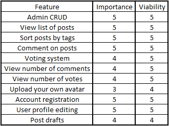
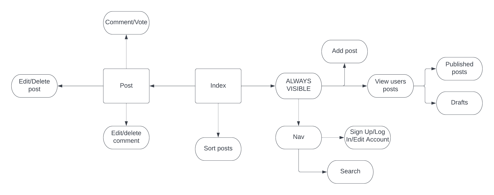
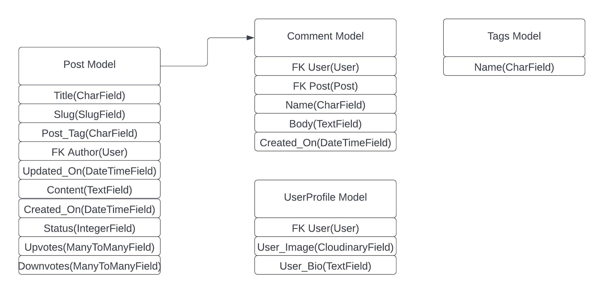
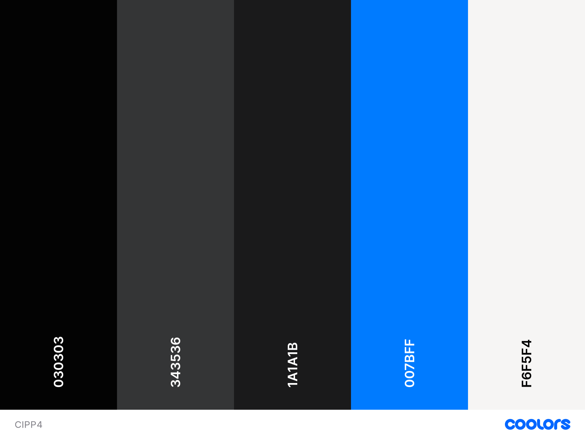

# Chatters

**[Live site](https://cipp4-eryk.herokuapp.com/)**

---

## Index

- <a href="#context">Context</a>
- <a href="#ux">UX</a>
  - <a href="#ux-stories">User stories</a>
  - <a href="#ux-strategy">Strategy</a>
  - <a href="#ux-scope">Scope</a>
  - <a href="#ux-structure">Structure</a>
  - <a href="#ux-wireframes">Wireframes</a>
  - <a href="#ux-design">Design</a>
- <a href="#features">Features</a>
  - <a href="#features-all">Design</a>
  - <a href="#features-all">Existing Features</a>
  - <a href="#features-future">Still to implement</a>
- <a href="#technologies">Technologies Used</a>
- <a href="#libraries">Libraries Used</a>
- <a href="#testing">Testing</a>
  - <a href="#testing-manual">User Stories</a>
  - <a href="#testing-manual">Manual</a>
  - <a href="#testing-unresolved">Unresolved issues</a>
  - <a href="#testing-bugs">Known bugs</a>
- <a href="#deployment">Deployment</a>
- <a href="#credits">Credits</a>

---

# **Context**

Chatters, a website where you can chat with other people about anything and everything. It is a community platform in the form of a blog where users can
interact with other users posts and share their opinions. Users can create an account where they can edit their profile image, their bio and other
settings.

<a style="text-align:right" href="#top">Go to index :arrow_double_up:</a>

# **UX**

## **User stories**

- As a **User** I want to be able to browse all posts and sort them by their tags.
- As a **User** I want to be able to see the amount of votes and comments on each post.
- As a **User** I want to be able to preview authors profile.
- As a **User** I want to be able to see the time of the posts and comments.
- As a **User** I want to be able to comment on posts and have the option to edit or delete them.
- As a **User** I want to be able to add posts with different tags and get option to publish or draft them.
- As a **User** I want to be able to react to users posts by upvoting or downvoting them.
- As a **User** I want to be able to edit my profile and upload an avatar.
- As a **User** I want to be able to search through all posts.

- As a **Admin** I want to be able to control all of user settings on one page.

<a style="text-align:right" href="#top">Go to index :arrow_double_up:</a>

## **Strategy**

### **Site Aims**

My main aim for the website was to let user to be able to save their posts for future reference as well as interacting with other users. I wanted to create a community where people can quickly access any type of topics they are interested in be it gaming or world news.

The website needs to let user to:

- Sort posts to their needs.
- Create and set up their account.
- Create posts with either published or draft status.
- Upvote or downvote each post.

### **Opportunities**

With the user stories in mind, I have made a table below to narrow down and prioritize the scope of intended strategy.

## **Scope**

A scope was defined to identify what was needed to be done in order to match the strategy outlined before.

- Content Requirements
  - The UX must address
    - A list of posts
    - Posts being sorted into categories (tags)
    - A list of users comments on posts
  - The UX should accommodate
    - Easy navigation
    - Ability to vote and comment

<a style="text-align:right" href="#top">Go to index :arrow_double_up:</a>

## **Structure**

I've created a flow charts to help me visualize what the navigation should feel like. I have also made one with the database scheme to guide me throughout the site progression.

As you can see in aboves images, my database scheme ended up quite accurate but there is one field currently not being used but will be in future implementations. The field I am talking about is in Post model and is **Updated_On**. I have plans to also add one for comments to be able to preview if the post was edited.

## **Wireframes**

The wireframes were successfully converted into a live functioning website across all devices.

The full suite of wireframes for **desktop**, **tablet** and **mobile** devices, can be accessed [here](wireframes/).

<a style="text-align:right" href="#top">Go to index :arrow_double_up:</a>

## **Design**

### **Colour Scheme**

After looking through different reddits and my preference of all websites I browse, I concluded that the best color scheme would be a simple **Dark Theme**. With plans in feature to implement a switch for light theme I though this can be a good idea. The below is the colours I have used the most.

### **Typography**

For fonts I decided to go with what reddit is using. The fonts are as follows, Verdana, Arial, Helvetica and Sans-serif. I think it gives site nice and clear look and ease of readability.

<a style="text-align:right" href="#top">Go to index :arrow_double_up:</a>
